# MicroBiotR: A Comprehensive R Toolkit for SOM-Based Microbiota Flow Cytometry and Downstream Machine Learning

## Overview

MicroBiotR is a comprehensive R pipeline developed for analysis between microbiota And host phenotype such as HC vs disease. The package delivers a robust framework for examining microbiota flowcytometry, aiming to pinpoint difference of bacterial community composition potentially linked to environmental factors and host phenotypes.

## Key Features

MicrobiotR provide an All-in-One framework that supports a wide array of microbiota flow cytometry clustering and analysis, including:
* **MBR_som**: SOM calculation and to obtain count-table.
* **MBR_stat**: performe statistical analyses to identify differentially abundant features between groups.
* **MBR_circle**: visualize distributions of features within imported data by presenting them in a circular form.
* **MBR_violin**: visualize abundance or expression levels for selected features.
* **MBR_beta**: visualize and assess beta diversity between groups (PCOA plot).
* **MBR_fs**: identifying and selecting a subset of the most predictive features.
* **MBR_heatmap**: visualize patterns of channels used in flowcytometry using a color-coded matrix.
* **MBR_mantel**: quantify and visualize the relationship between features in data and clinical or demographic metadata.
* **MBR_ml**: apply machine learning algorithms and visualize using ROC curve.
* **MBR_conf**: visualize confusion matrix.
* **MBR_reclustering**: recluster the clustering results obtained from an initial Self-Organizing Map (SOM) analysis.
* **MBR_read**: load fcs file.
* **MBR_process**: prepare data for downstream analytical steps.
* **MBR_prepare**: prepare data for downstream analytical steps.
* **MBR_plot**: visualize dot plot of selected features.
* **MBR_save**: save new fcs files with user-customized clusters.

Type the function name to see its documentation
* ?MBR_som
* ?MBR_stat
* ?MBR_circle
* ?MBR_violin
* ?MBR_beta
* ?MBR_fs
* ?MBR_heatmap
* ?MBR_mantel
* ?MBR_ml
* ?MBR_conf
* ?MBR_reclustering
* ?MBR_plot
* ?MBR_save

***The FCS data used in this tutorial was generated by a BD Influx flow cytometer***

## Installation

You can firstly install these dependencies prior to installing `MicroBiotR`

```markdown
# install.packages("devtools")
devtools::install_github("Hy4m/linkET", force = TRUE)
packageVersion("linkET")

if (!require("BiocManager", quietly = TRUE))
    install.packages("BiocManager")
BiocManager::install("Biobase")

install.packages("viridis")

devtools::install_github("Bioconductor/Biobase", force = TRUE)
install.packages("BiocManager", repos = "https://cran.R-project.org")
BiocManager::install("flowCore")

```

You can install the released version of `MicroBiotR` from [GitHub](https://github.com/agchang1/MicroBiotR) with the following R commands:

```markdown
# install.packages("devtools")
devtools::install_github("9cGU/MicroBiotR", force = TRUE)
packageVersion("MicroBiotR")
```

Before you run MBR_som(), please gate first [how_to_gate](gating/Gating.R)

## SOM analysis
```markdown
# load libraries
library(MicroBiotR)
library(linkET)
library(Biobase)
library(flowCore)

# SOM analysis
MBR_som(fl_data_ig)
```

## Statistics
```markdown
# load matadata
meta<-read.delim('meta.txt',header = T, row.names = 1)

# test type should be one of 'wilcoxon', 'kruskal', 'anova' ,'ttest'
# correction could be one of 'none', 'fdr', 'bonferroni' ,'BH'
MBR_stat(data = count_table, group_col = 'Group', meta_data = meta, 
       test_type = 'wilcox', out_path = './', 
       correction = 'fdr', cutoff = 0.001)
```

## Analysis
```markdown
# Circular plot
MBR_circle(data = significant_data, group_col = 'Group', meta_data = meta, width = 16, 
         height = 16, out_path = './')

# Violin plot
MBR_violin(data = significant_data, meta_data = meta, group_col = "Group",
           pvalue_data = pvalue_data, p = "p.adj",colors = c('#FFADAD', '#DEDAF4'), cluster = 1948, out_path = './')

# PCOA
# test should be one of 'wilcox', 'ttest', 'kruskal', or 'anova'
MBR_beta(significant_data, out_path = './', test = 'wilcox', 
       meta_data = meta, group_name = 'Group', colors = c('#FFADAD', '#DEDAF4'))
```

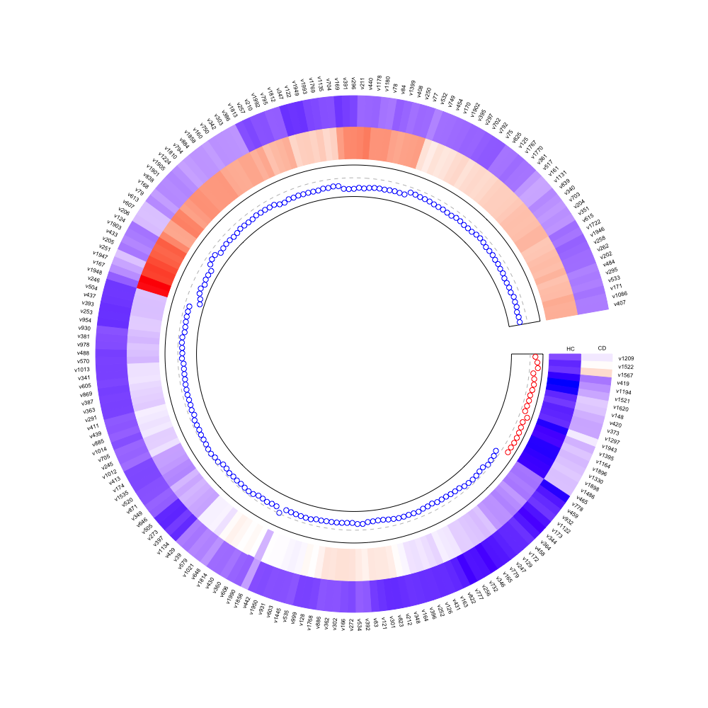
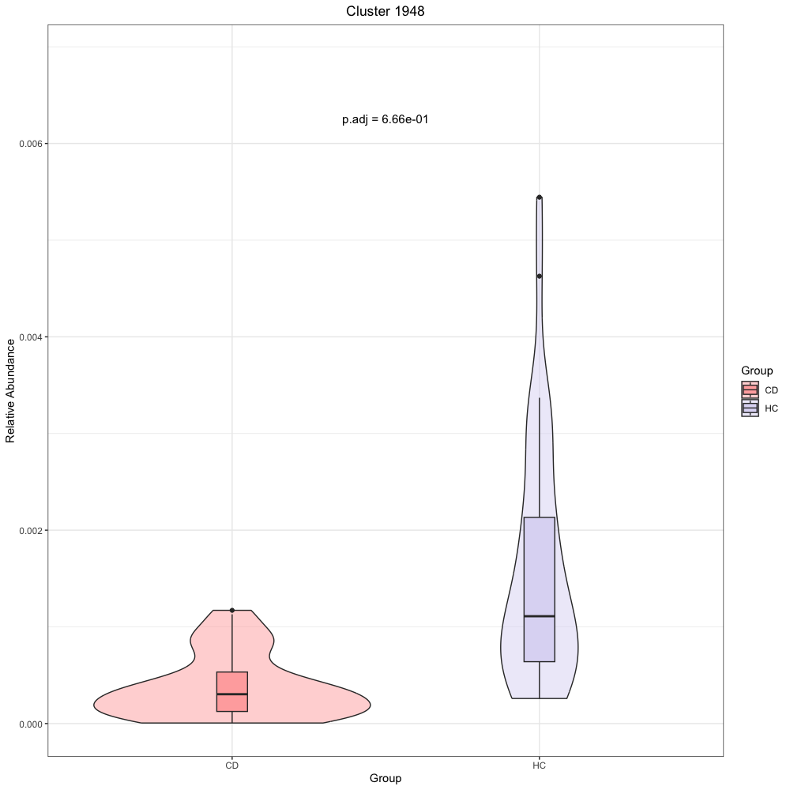
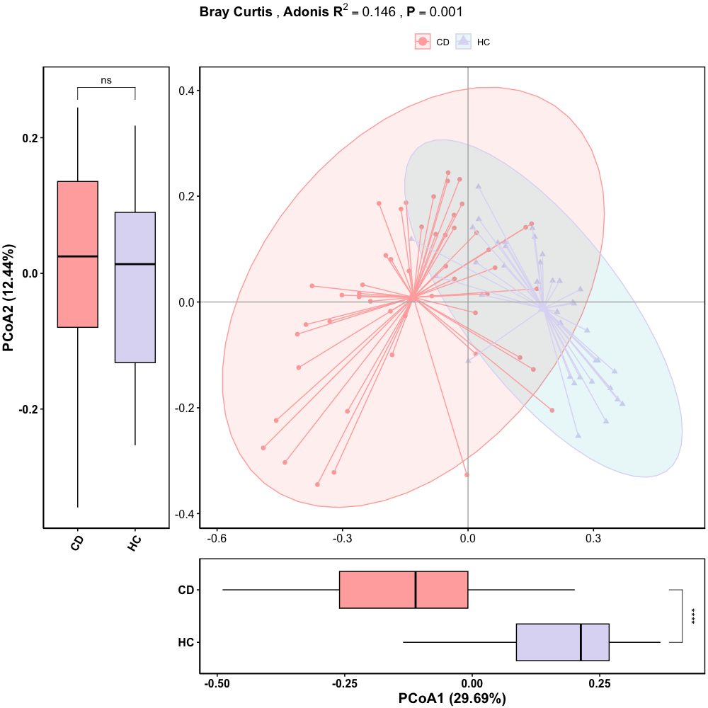

## Feature selection
```markdown
# Feature selection
MBR_fs(significant_data, out_path = './', 
     nfolds_cv = 5, rfe_size=199, top_n_features =10,group_name = 'Group', 
     meta_data = meta,ref_group = 'CD', colors = c('#FFADAD', '#DEDAF4'))

# Heatmap
MBR_heatmap(data = MBR_selected_features[,1:184], 
          cohonen_information = cohonen_information, 
          out_path = './', scale = 'row', cluster_cols = F, 
          cluster_rows = T, display_numbers = F)

# Correlation
MBR_mantel(
  data = MBR_selected_features[,1:10],
  meta_data = meta,
  clinical_cols = c("Clinical1", "Clinical2"),
  demographic_cols = c("Demographic1", "Demographic2"),
  spec_select_names = list(A = "Clinical", B = "Demographic"),
  out_path = './',  
  width = 6,
  height = 6
)
```
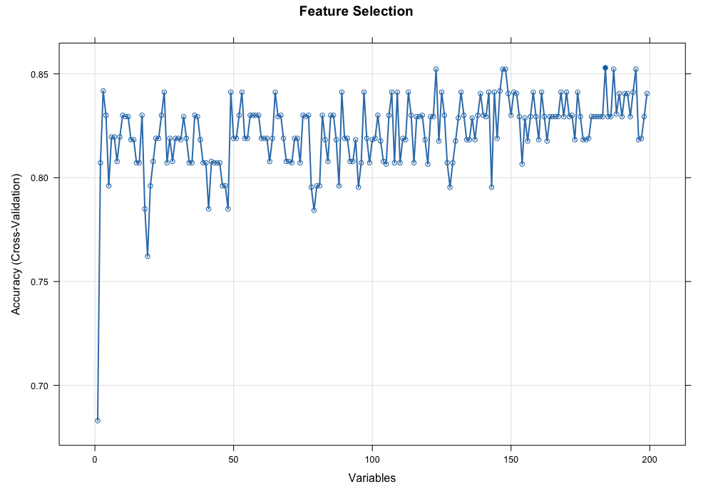
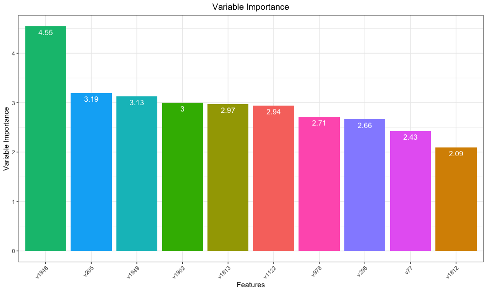
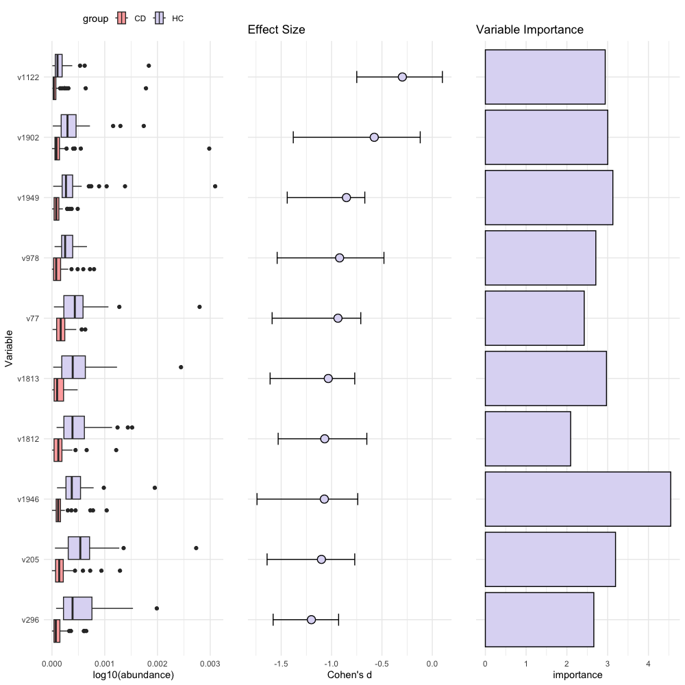
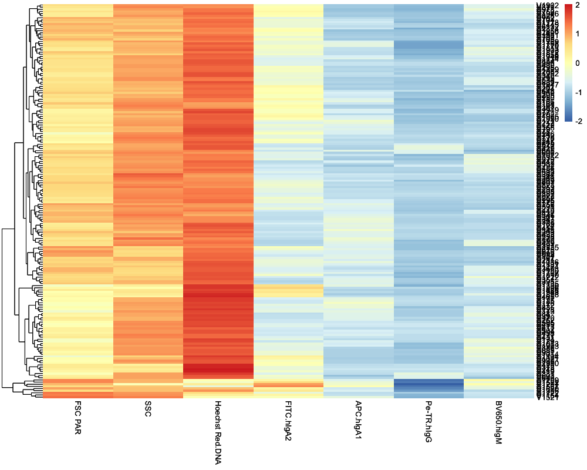
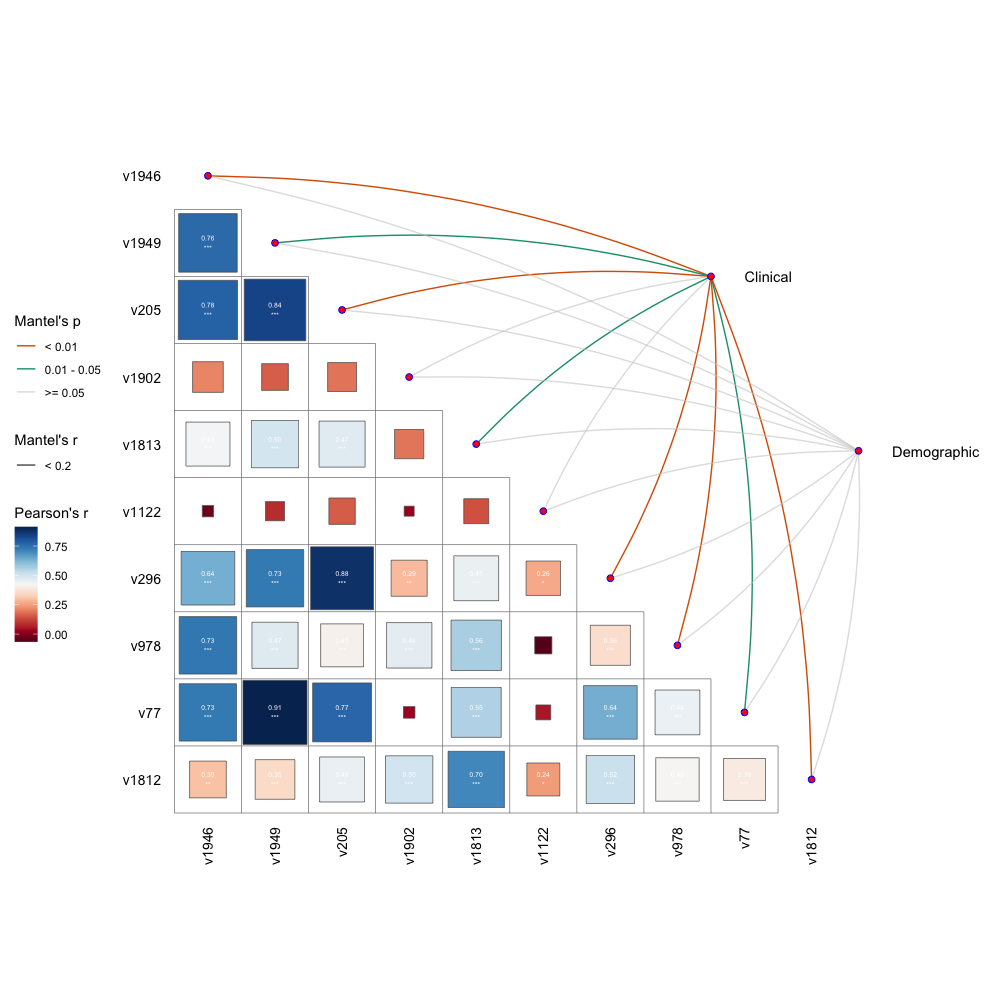

## Machine learning
```markdown
MBR_ml(
  data = MBR_selected_features,        # your feature table (samples as rows, taxa as columns)
  meta_data = meta,          # metadata dataframe (samples in same order as `data`)
  group_name = 'Group',             # column name in metadata containing group labels
  out_path = './',          # directory to save output PDF and group file
  reference_level = 'CD',            # reference group (e.g., "A" or "Control")
  width = 6,                        # width of the output plot PDF
  height = 6,                       # height of the output plot PDF
  method = 'repeatedcv',           # resampling method (e.g., repeated cross-validation)
  number = 5,                       # number of folds
  repeats = 2                       # number of repeats
)

MBR_conf(
  data = MBR_selected_features,
  meta_data = meta,
  group_name = 'Group',
  reference_level = 'CD',
  out_path = './'
)
```
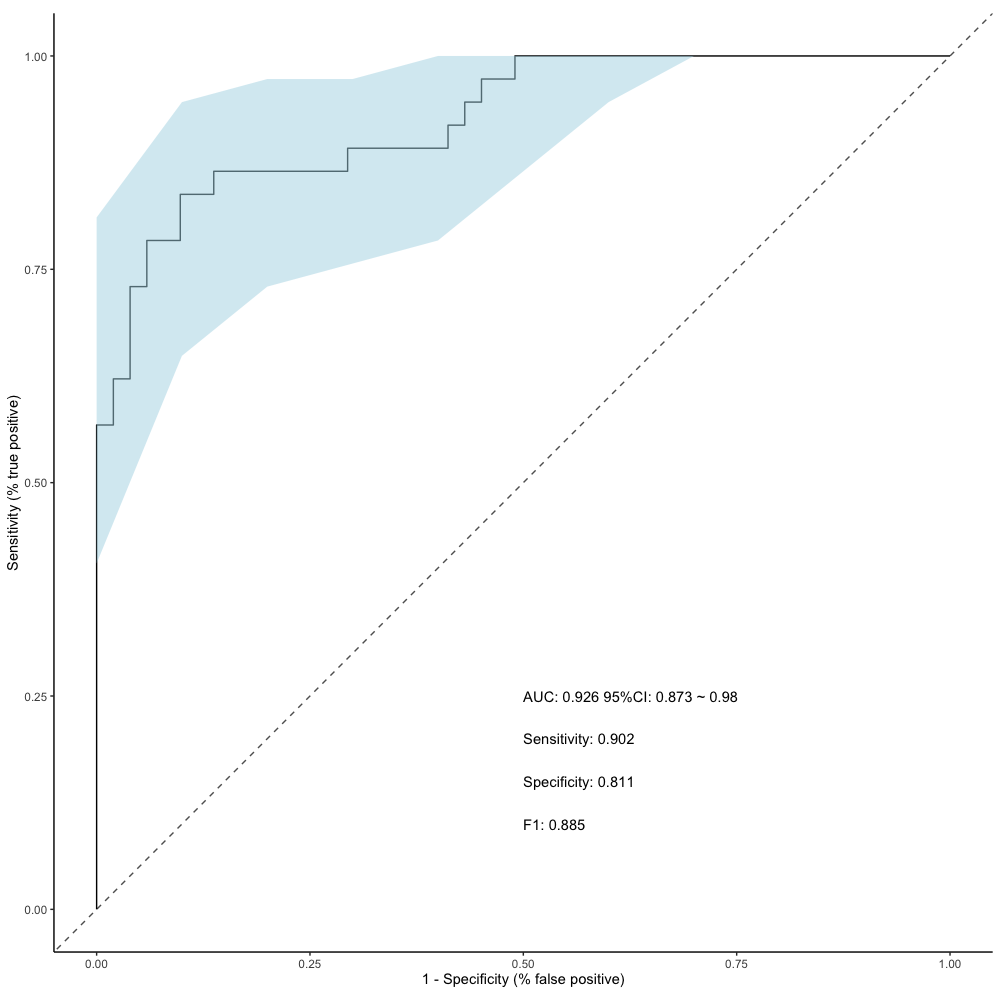
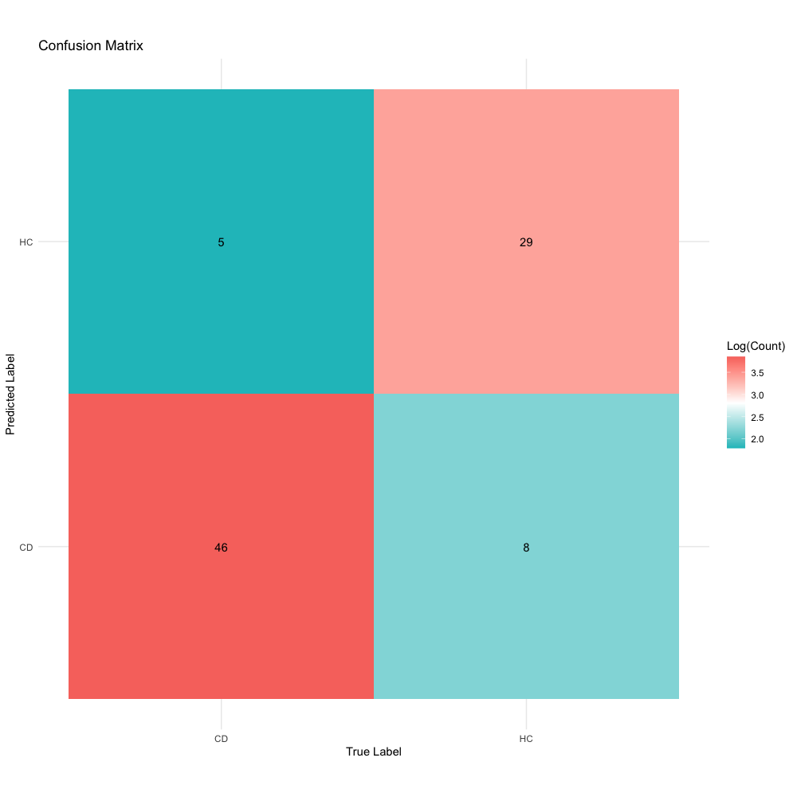

## Reclustering
```markdown
MBR_reclustering(data = cohonen_information, num_clusters = 1000)
```

## Flowcytometry dotplot
```markdown
rawdata_path <- "/MappedFCS"

fcs_files <- MBR_read(rawdata_path)

selected_rows <- c('V1269','V1544','V1020','V1252','V1118','V1117', 'V1295')


column_mapping <- c(
  "FSC PAR"        = "FSC.PAR",
  "SSC"            = "SSC",
  "Hoechst.Red.DNA"= "Hoechst.Red",   
  "Hoechst.Red"    = "Hoechst.Red",
  "Hoechst Red.DNA"    = "Hoechst.Red",
  "FITC.hIgA2"     = "FITC",
  "FITC"           = "FITC",
  "APC.hIgA1"      = "APC",
  "APC"            = "APC",
  "Pe-TR.hIgG"     = "Pe.TR",
  "Pe.TR.hIgG"     = "Pe.TR",
  "Pe.TR"          = "Pe.TR",
  "BV650.hIgM"     = "BV650",
  "BV650"          = "BV650"
)


plot_params <- list(
  list(x = "FSC.PAR", y = "SSC"),
  list(x = "FSC.PAR", y = "Hoechst.Red"),
  list(x = "FITC", y = "APC"),
  list(x = "Pe.TR", y = "BV650")
)

dat <- MBR_process(
  fcs_files,
  file_index = 1,
  transformation = function(x) 10^((4 * x) / 65000),
  column_mapping = column_mapping
)

bins <- MBR_prepare(
  cohonen_information,
  selected_rows = selected_rows,
  transformation = function(x) 10^((4 * x) / 65000),
  column_mapping = column_mapping
)


plots <- MBR_plot(
  dat = dat,
  bins = bins,
  plot_params = plot_params,
  selected_rows = selected_rows
)

print(plots)
```

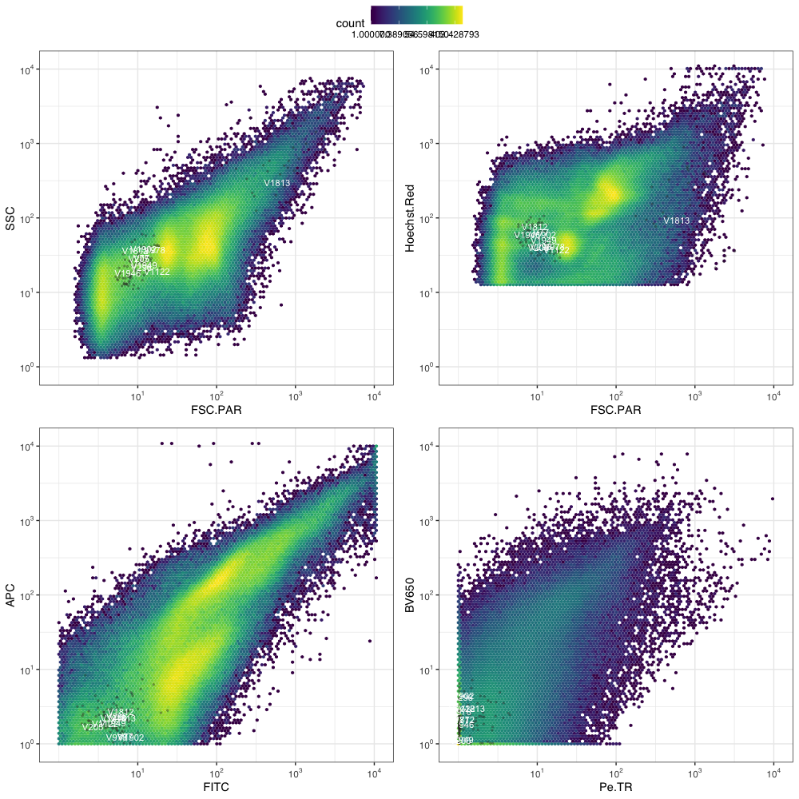

## Saving user-customized fcs file
```markdown
MBR_save(
  fcs_files = fcs_files,
  dat = dat, 
  selected_rows = c("V9", "V10"),
  file_index = 1,
  rawdata_path = rawdata_path
)
```


